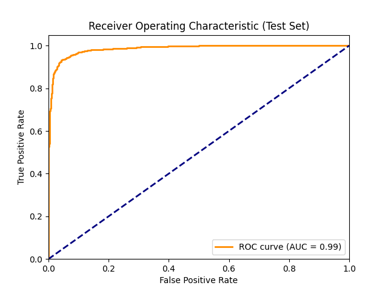
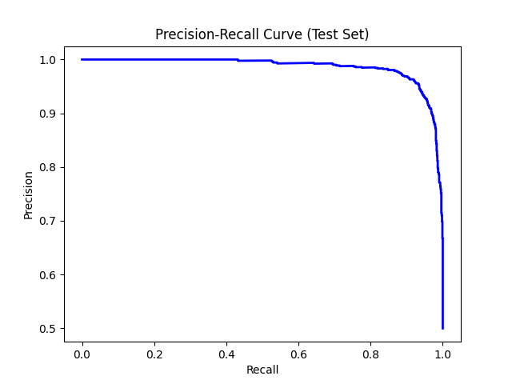

# Skin Cancer Classification with PyTorch

A modular pipeline for skin cancer image classification using PyTorch, including data loading, preprocessing, model training, evaluation, and result saving.

This project is developed according to MLOps best practices and uses MLflow for experiment tracking and model management.

---

## Project Structure

```text
skin_classification/
├── configs/           # Configuration files (hyperparameters, paths)
│   └── config.yaml
├── data/              # Raw and processed datasets (not tracked by git)
├── models/            # Saved model weights
├── results/           # Evaluation outputs (figures, metrics, logs)
├── src/               # Modular Python scripts
│   ├── __init__.py
│   ├── data_loader.py
│   ├── eval.py
│   ├── model.py
│   ├── prepare_data.py
│   ├── preprocessing.py
|   |-- mlflow_utils.py
│   ├── train.py
│   └── utils.py
|-- start_mlflow_ui.py
├── requirements.txt   # Python dependencies
├── setup.py           # (Optional) For pip installability
└── README.md          # Project documentation
```

---

## MLflow & MLOps

This project leverages [MLflow](https://mlflow.org/) for experiment tracking, parameter logging, metric monitoring, and model registry as part of an MLOps-compliant workflow. With MLflow:
- All training and validation metrics are automatically logged
- Parameters and model weights are tracked
- Experiments can be easily compared
- The best models are versioned and managed in the model registry

You can visualize and analyze your experiment history using the MLflow UI.

### MLflow Usage

1. MLflow runs automatically during training:
   ```bash
   python src/train.py --config configs/config.yaml
   ```
2. To launch the MLflow UI:
   ```bash
   python start_mlflow_ui.py
   ```
   or
   ```bash
   mlflow ui --backend-store-uri sqlite:///mlflow.db
   ```
   Access the UI at: http://localhost:5000
3. Use utility scripts to manage experiments and models:
   ```bash
   python src/mlflow_utils.py --action list_experiments
   python src/mlflow_utils.py --action list_runs --experiment skin_cancer_classification
   python src/mlflow_utils.py --action compare --experiment skin_cancer_classification
   python src/mlflow_utils.py --action plot --experiment skin_cancer_classification
   ```

---

## Dataset

The Melanoma Cancer Dataset contains skin lesion images for binary classification of benign vs malignant cases. This dataset is commonly used for skin cancer detection research and provides a balanced set of images for training deep learning models.

- **Source:** [Melanoma Cancer Dataset (Kaggle)](https://www.kaggle.com/datasets/bhaveshmittal/melanoma-cancer-dataset/data)
- **Format:** Images are organized in folders by class for use with `torchvision.datasets.ImageFolder`.
- **Classes:** Benign (non-cancerous) and Malignant (cancerous) skin lesions

---

## Installation

```bash
git clone <repo_url>
cd skin_classification
python -m venv venv
# On Windows:
venv\Scripts\activate
# On Linux/Mac:
source venv/bin/activate
pip install -r requirements.txt
```

---

## Usage

### 1. Download Pre-trained Model

Download the pre-trained model weights from Google Drive:
- **Model Download Link:** [Best Model](https://drive.google.com/drive/u/0/folders/17zmHUAkDIDhbQtno_ZXciFOjNNpcVQcQ)
- Place the downloaded model file in the `models/` directory

### 2. Prepare Data

Edit `configs/config.yaml` to set your data paths. Then run:
```bash
python src/prepare_data.py --config configs/config.yaml
```

### 3. Train Model (Optional)
If you want to train the model from scratch:
```bash
python src/train.py --config configs/config.yaml
```

### 4. Evaluate Model
```bash
python src/eval.py --config configs/config.yaml
```

---

## Model Performance

- **Model:** EfficientNetV2L with transfer learning
- **Image Size:** 112x112 pixels
- **Batch Size:** 32
- **Learning Rate:** 0.001
- **Epochs:** 50

### Results

The model achieved excellent performance on the test set:

- **Overall Accuracy:** 94%
- **Precision (Benign):** 93%
- **Recall (Benign):** 96%
- **F1-Score (Benign):** 95%
- **Precision (Malignant):** 95%
- **Recall (Malignant):** 93%
- **F1-Score (Malignant):** 94%

### Performance Visualizations

The following visualizations show the model's performance:


*Confusion Matrix showing true vs predicted labels*


*ROC Curve showing the model's discriminative ability*


*Precision-Recall Curve showing the trade-off between precision and recall*

### Detailed Classification Report

```
              precision    recall  f1-score   support

      Benign       0.93      0.96      0.95      1000
   Malignant       0.95      0.93      0.94      1000

    accuracy                           0.94      2000
   macro avg       0.94      0.94      0.94      2000
weighted avg       0.94      0.94      0.94      2000
```

---

## Frontend Integration Guide

If you are integrating this model into a web frontend (e.g., allowing patients to upload images for prediction), follow these steps:

1. **Export the Trained Model:**
   - The best model weights are saved in the `models/` directory (e.g., `best_model.pth`).

2. **Create an Inference Script or API:**
   - Use the model definition in `src/model.py` and the preprocessing steps in `src/preprocessing.py`.
   - Example inference code:
     ```python
     import torch
     from src.model import get_model
     from src.preprocessing import get_val_transform
     from PIL import Image

     device = torch.device('cuda' if torch.cuda.is_available() else 'cpu')
     model = get_model(device)
     model.load_state_dict(torch.load('models/best_model.pth', map_location=device))
     model.eval()

     def predict(image_path):
         img = Image.open(image_path).convert('RGB')
         transform = get_val_transform(112)
         input_tensor = transform(img).unsqueeze(0).to(device)
         with torch.no_grad():
             output = model(input_tensor)
             prob = torch.sigmoid(output).item()
         return prob
     ```
   - This function returns a probability score (0-1) for malignancy.

3. **REST API Example:**
   - You can wrap the above logic in a Flask or FastAPI server to accept image uploads from the frontend and return predictions.

4. **Frontend Workflow:**
   - User uploads an image via the web interface.
   - The image is sent to the backend API.
   - The backend runs the model and returns the probability of malignancy.
   - The frontend displays the result to the user.

5. **Requirements for Deployment:**
   - Ensure the server has a GPU and CUDA installed for fast inference (if available).
   - Install all dependencies from `requirements.txt`.
   - Expose the API endpoint securely.

---

## Requirements

- Python 3.8+
- See `requirements.txt` for all dependencies (PyTorch, torchvision, scikit-learn, etc.)
- CUDA and GPU support recommended for training and inference

---

## Data Format

- Place raw images in `data/raw/`
- Processed data will be saved in `data/processed/`
- Update paths in `configs/config.yaml` as needed

---

## Notes

- Large datasets should not be committed to git.
- For reproducibility, set random seeds in config.
- For more details, see the scripts in the `src/` directory.
