# REGAI

**Product Name:** RegAI  
**Backlog URL:** [Asana Project Board](https://app.asana.com/1/1205900998273390/project/1210594927472810/list/1210595154454975)  

---

## Project Objective

The main objective of this project is to enable individuals who are concerned about their health to perform an early-stage evaluation and to support their process of consulting healthcare professionals.  
To achieve this, two customized language model configurations and advanced image processing technologies are used together, aiming to help users assess their situation more reliably.

---

## Project Overview

Users visit the web platform and provide a brief description of their health complaint. The system then proceeds through three stages:

1. **General Assessment:**  
   The system interacts conversationally with the user, asking general follow-up questions (e.g., age, lifestyle) to identify the most likely related cancer type.

2. **Detailed Analysis:**  
   The system asks targeted, cancer-specific questions to gather more detailed information, which it analyzes for a deeper evaluation.

3. **Image Processing:**  
   If the user uploads medical images, these images are analyzed using specialized models for various cancer types, and the system provides informative feedback.

---

## Product Features

- **Short Text-Based Initial Assessment:**  
  Users enter a brief description of their health concerns. The system uses natural language processing to analyze the input and then continues by asking general follow-up questions (e.g., age, lifestyle) to gather additional information and suggest the most likely related cancer type.

- **Conversational Cancer-Specific Inquiry:**  
  Following the initial assessment, the system engages users with detailed, relevant questions specific to the identified cancer type, analyzing responses to produce comprehensive evaluations.

- **Medical Image Upload and Analysis:**  
  Users can upload medical images (e.g., MRI, X-ray), which are processed with specialized image analysis models to provide diagnostic feedback.
ied cancer type.  
  The system then provides informative feedback based on the analysis results.

---

## Target Audience

- Individuals who are concerned about their health
- Users with a family history of cancer
- Adults who wish to perform preliminary screening
- Researchers interested in AI- and image-processing-based health solutions

---

<strong style="font-size:1.5em">Technologies Used</strong>

### Design
- **Figma** (Page prototypes and UI designs)

### Frontend
- **React** (Fast development environment with Vite.js)
- Responsive and modular structure

### Database
- **Firebase** (User data storage and session management)

### Backend
- **Python** (FastAPI framework)

### LLM (Large Language Model)
- **Gemini** (Natural language processing for health-related text input)

### Machine Learning (Image Processing)
- **Python 3.10+**
- **PyTorch**
- **torchvision**
- **NumPy**
- **Matplotlib**

---

## Team Members

<table>
    <tr>
      <th>Name</th>
      <th>Title</th>
      <th>Socials</th>
    </tr>
      <td>İremsu Koç</td>
      <td>Scrum Master</td>
      <td>
        
        
        
      </td>
    </tr>
    <tr>
      <td>Muhammed Emin Erdağ</td>
      <td>Product Owner</td>
      <td>
        
        
        
      </td>
    </tr>
    <tr>
      <td>Cemre Üstün</td>
      <td>Developer</td>
      <td>
        
        
      </td>
    </tr>
    <tr>
      <td>Ali İhsan Acar</td>
      <td>Developer</td>
      <td>
        
        
      </td>
    </tr>
    <tr>
      <td>Sefa Sinanoğlu</td>
      <td>Developer</td>
      <td>
        
        
      </td>
    </tr>
</table>

---

  

<strong style="font-size:4em">📋 Sprint 1</strong>

### **Sprint Duration**
June 23, 2025 (Monday) - July 6, 2025 (Sunday) *(Two weeks)*

---

<strong style="font-size:2em">Sprint Notes</strong>

#### Completed
- Frontend development was completed faster than planned.  
- General testing was conducted on the LLM module, and advanced prompt trials for the second phase were initiated.  
- Backend setup and integration were carried out successfully.  
- Machine learning models were identified on Kaggle and reached the stage of local deployment.  

---

#### Challenges Encountered
- The project name and logo selection process could not be finalized.  
- The product scope was not clearly defined at the start of the sprint, leading to frequent task and design changes.  
- Frontend testing processes showed notable gaps.  
- Code review durations were long, resulting in PRs staying open for extended periods.  

---

#### Solutions
- Prioritize the selection of the project name and logo in the next sprint.  
- Finalize the product scope before the sprint starts to avoid scope changes.  
- Improve frontend testing and prepare detailed manual test documentation.  
- Send regular notifications via communication channels to accelerate code reviews.  

---

#### Lessons Learned
- Team members understanding their responsibilities and areas of ownership contributes to smoother workflows.  
- Consistent meeting participation and clear communication created a major advantage in tracking progress. As a result, task allocation became clearer and progress exceeded expectations.  
- Maintaining strong internal communication and regular follow-up on tasks directly improves sprint efficiency.  

---

<strong style="font-size:2em">Estimated Completion Points</strong>

<strong>67 points</strong>

---

<strong style="font-size:2em">Estimation Logic</strong>

Sprint task estimation was based on <strong>hour-based workload</strong> estimates using the following methodology:

| **Estimated Time** | **Story Points** |
|:------------------:|:----------------:|
| 1 day (8 hours) | 4 |
| Half day (4 hours) | 2 |
| 2 hours | 1 |
| 1 hour and below | 0.5 |

Due to team members' various responsibilities such as internships and work commitments, weekday working hours were expected to be more limited while weekends would be more intensive. Therefore, task time estimates and point allocation were planned considering this balance:

- **Weekdays:** Typically 1-2 hour work blocks were planned
- **Weekends:** Longer focused work sessions (4-5 hours) were targeted

Consequently, task time estimates and point allocation were prepared considering this balance, and the sprint target was set at **67 points** total.

---

<strong style="font-size:2em">Sprint Tasks</strong>

#### **Design (7 points)**
- Login, Signup, Main Page, Profile Pages, and Dashboard designs (additional support pop-up screen was designed)

#### **Frontend (8 points)**
- Developed user login, signup, and main page designs using React and Vite.js in a responsive (mobile-friendly) and modular manner
- Prepared basic project structure files (package.json, .gitignore)

#### **Backend (8 points)**
- Selected Firebase database for the project and created necessary tables
- Developed and tested user login, signup, and authentication processes using Python and FastAPI

#### **Language Model and Machine Learning**

**Language Model (LLM) - 12 points:**
- Prepared custom system prompts for the Gemini model to perform general health assessments and added restrictions
- Created and tested exit logic for proper model functioning

**Machine Learning (ML) - 24 points:**
- Researched appropriate ultrasound image datasets for breast cancer diagnosis and performed data preprocessing
- Created and trained a ResNet-based model for classification
- Evaluated model accuracy and performance, saved the best performing model
- Developed and tested data transformation methods required for model usage

---

<strong style="font-size:2em">Daily Scrum</strong>

Initially, WhatsApp was used for Daily Scrum notifications and tracking. However, to ensure a more organized and manageable process, we transitioned to using Google Forms. The final form (shown below) was created, and reminder messages were sent via WhatsApp to each team member to complete the form daily.

Responses submitted through the form are automatically collected and stored in a Google Sheet, providing a centralized and easily accessible record. This approach has made daily progress tracking more transparent and systematic.

**WhatsApp Screenshot:**  
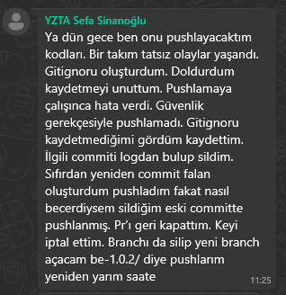

**Google Form Screenshot:**  

---

<strong style="font-size:2em">Sprint Board Screenshots</strong>

Throughout the sprint, the team used Asana to track the progress of all tasks, monitor their current status, and ensure alignment with the sprint goals.  
Below are the screenshots of the sprint board at different stages to illustrate how tasks were organized, assigned, and moved across columns (e.g., To Do, In Progress, Done).

**Sprint Board Screenshots:**  

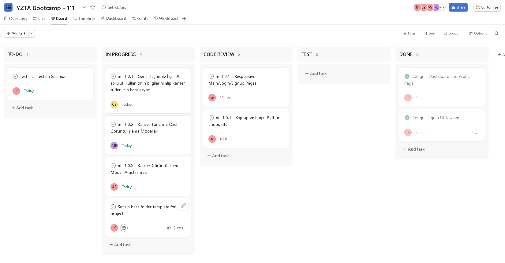

---

<strong style="font-size:2em">Product Progress Screenshots</strong>

---

<strong style="font-size:1em">Frontend</strong>

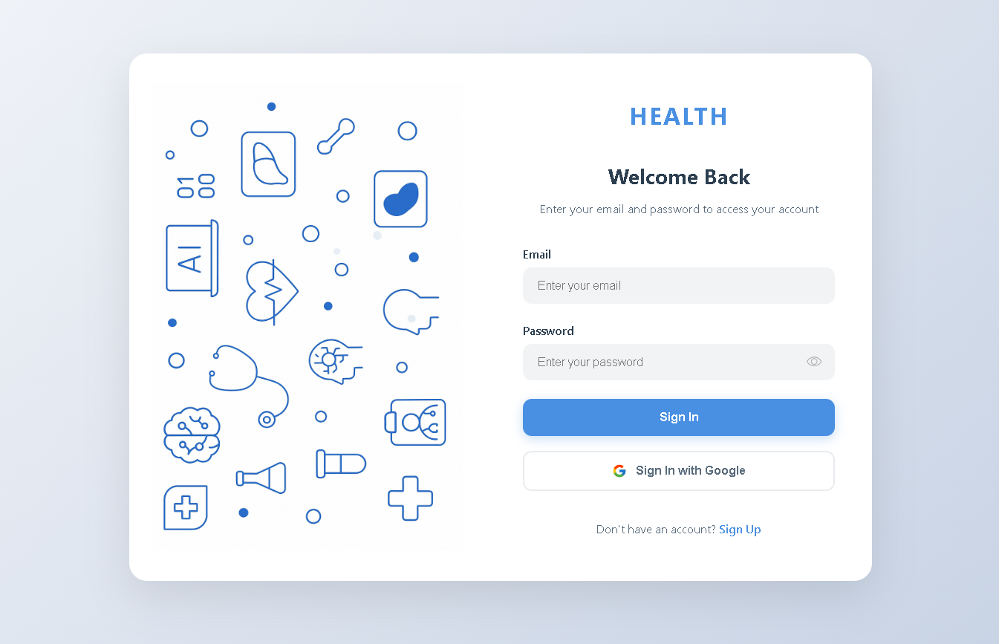

---

<strong style="font-size:1em">Backend</strong>

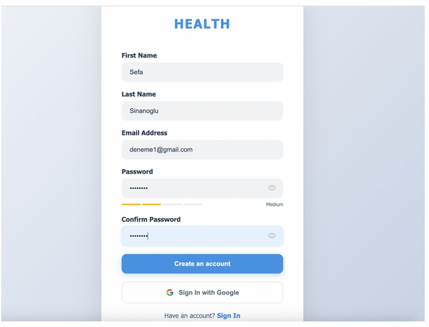

---

<strong style="font-size:1em">Machine Model</strong>

---

<strong style="font-size:1em">Language Model (LLM)</strong>

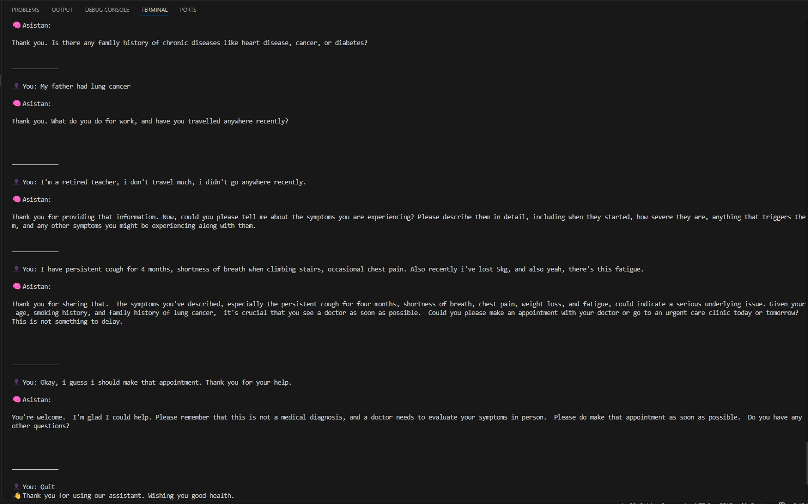

---

<strong style="font-size:2em">Sprint Review</strong>

The planned work for this sprint was successfully completed:

- While Login, Signup, and Main Page designs were initially planned to be created on Figma, due to rapid frontend development progress, Profile and Dashboard page designs were also completed and revised
- Frontend development basic modules were implemented responsively for Login, Signup, and Main Page. Revisions were made according to code review (CR) feedback and responsive behavior was manually tested
- Backend user authentication and database connection were made functional using Python
- Breast cancer classification model was trained, tested, and output accuracy was evaluated
- System prompts required for LLM integration were written, validated in test environment, and additional revisions were implemented
- During the sprint process, the team discussed how design, development, and model integration would work together and established a common working methodology

---

<strong style="font-size:2em">Sprint Retrospective</strong>

### What Went Well

- All team members attended meetings consistently and maintained effective, transparent communication regarding ongoing work.
- Team members eagerly took on their tasks and responsibilities, completing them on time and with diligence.
- Issues encountered were openly raised and constructively discussed, leading to actionable solutions.
- The frontend development progressed faster than planned, enabling early achievement of sprint goals.
- In the LLM (Large Language Model) area, not only were prompts developed for general testing, but successful trials of more advanced prompts for the second phase were also initiated.
- The backend infrastructure was set up and connected on schedule.
- Leveraging the Kaggle platform and research by a dedicated team member, ready-made machine learning models for breast cancer were identified. These models are currently in the process of being run locally, which has accelerated progress on the ML side.

### What Went Badly

- No final decision has yet been made regarding the project name and logo; this issue needs to be prioritized and addressed promptly.
- The product scope was not fully defined at the outset, resulting in frequent scope changes during development; this particularly affected task and design revisions in the frontend and machine learning areas.
- There is hesitation in submitting code reviews (CR), and the review process duration is long, causing pull requests (PRs) to remain open for extended periods.

### Areas for Improvement

- Finalize product scope before sprint start to minimize mid-sprint changes. 
- Enhance frontend testing and prepare detailed test documentation including manual test steps. 
- Implement a regular notification system through communication channels to encourage timely code review submissions and reduce PR open times. 

### Next Sprint Tasks

- Prioritize selection of project name and logo to establish brand identity.
- Complete UI, backend, LLM, and ML integration and conduct thorough testing. 
- Develop prompts specifically targeting the detailed analysis phase of the LLM module. 
- Run image classification model locally for an additional selected cancer type.

---

<strong style="font-size:2em">Communication and Project Management Tools</strong>

- **Code Management:** All code repositories are managed on GitHub, with version control in place. The development process is tracked through pull requests.

- **Project Management:** Task assignments and sprint tracking are carried out via the Asana platform.

- **Team Communication:** Instant communication within the team is facilitated through WhatsApp.

- **Daily Progress Tracking:** Initially, daily progress updates were shared via WhatsApp. To ensure more structured and centralized tracking, this process has been updated, and daily reporting is now conducted through Google Forms. Each team member fills out a short form at the end of the day to report completed work and any encountered blockers.

- **Weekly Meetings:** During the meetings, team members share what they have done, any problems they are facing, what they plan to do next, and what actions they will take before the next meeting. These online meetings are held twice a week (Mondays at 22:00 and Fridays at 22:00) via Google Meet.

<strong style="font-size:4em">📋 Sprint 2</strong>

### **Sprint Duration**
July 7, 2025 (Monday) - July 20, 2025 (Sunday) *(Two weeks)*

---

<strong style="font-size:2em">Sprint Notes</strong>

#### Completed
- The implementation of new pages were successfully completed. The assigned team member also took the initiative to design and develop additional pages such as FAQ and History, which were listed in the side navigation but not initially planned within the sprint scope.
- The project structure was reorganized into a more modular form. Since the frontend implementation of the login process was necessary for backend testing, corresponding login functionalities were also developed and integrated into the backend. Additionally, critical endpoints for connecting with the Large Language Model (LLM) were implemented.
- Machine learning models targeting various types of cancer were successfully developed. During this sprint, image classification models were trained to detect colon, lung, and leukemia cancers.
Furthermore, data transformation and prediction methods were implemented in Python to support the deployment of these models. As a result, the foundational logic required for integrating the models with backend services has been established.

---

#### Challenges Encountered
- Although frontend testing has started, progress has been slower than expected.
- The LLM integration, which is essential for enabling detailed analysis, has not yet been completed.
- While initial efforts to connect ML models with backend services have begun, full integration and testing for even a single model have not yet been achieved.

---

#### Solutions
- Since the development of ML models has been completed, the related team members will be reassigned to accelerate backend development efforts.
- To support the LLM development process, a team member will be assigned to assist and coordinate regular technical meetings to ensure progress and alignment.

---

#### Lessons Learned
- Proactively taking initiative beyond assigned tasks contributed positively to sprint outcomes and overall product quality.
- Early identification of integration dependencies, especially between ML models and backend services, is crucial to avoid last-minute delays.
- Regular and structured communication, including consistent meeting participation, significantly improved task tracking and team alignment.

---

<strong style="font-size:2em">Estimated Completion Points</strong>

<strong>86 points</strong>

---

<strong style="font-size:2em">Estimation Logic</strong>

Sprint task estimation was based on <strong>hour-based workload</strong> estimates using the following methodology:

| **Estimated Time** | **Story Points** |
|:------------------:|:----------------:|
| 1 day (8 hours) | 4 |
| Half day (4 hours) | 2 |
| 2 hours | 1 |
| 1 hour and below | 0.5 |

Due to team members' various responsibilities such as internships and work commitments, weekday working hours were expected to be more limited while weekends would be more intensive. Therefore, task time estimates and point allocation were planned considering this balance:

- **Weekdays:** Typically 1-2 hour work blocks were planned
- **Weekends:** Longer focused work sessions (4-5 hours) were targeted

Consequently, task time estimates and point allocation were prepared considering this balance, and the sprint target was set at **67 points** total.

---

<strong style="font-size:2em">Sprint Tasks</strong>

#### **Design (2 points)**
- Completed logo design.

#### **Frontend (8 points)**
- Developed dashboard and profile page designs using React and Vite.js.
- Implemented with a responsive (mobile-friendly) and modular structure.

#### **Backend (8 points)**
- Reorganized the project folder structure and configured scripts to run using Poetry.
- Designed the structure for initializing and storing chat sessions within the General Test context. 
- Integrated the LLM created for the General Test with the backend.
- Tested all endpoints via Postman and added .md documentation files to support understanding for other team members.

#### **Language Model and Machine Learning**
**Machine Learning  (ML) - 60 points:**
- Developed image classification models for the following cancer types. Suitable datasets were sourced, models were trained and tested, and necessary data transformation and prediction methods were implemented in Python:
  - Colon Cancer
  - Lung Cancer
  - Leukemia (Blood Cancer)
  - Brain Tumor
  - Skin Cancer

**Language Model (LLM) - 8 points:**
- Initiated the creation and testing of LLM prompt to enable detailed analysis, particularly tailored for the cancer types covered by the ML models. The work is still in progress and will be continued in the next sprint.

---

<strong style="font-size:2em">Daily Scrum</strong>

The daily scrum process, conducted via Google Form, was continued in this sprint because it had yielded high efficiency in previous sprint. Team members were encouraged to complete the forms daily with reminders sent via WhatsApp.

**WhatsApp Screenshots:**  

**Google Form Screenshot:**  

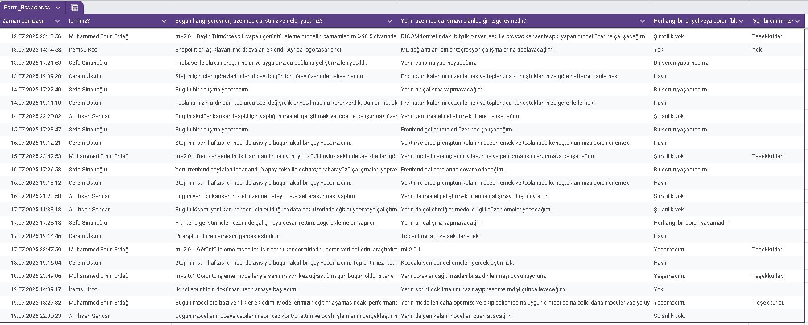

---

<strong style="font-size:2em">Sprint Board Screenshots</strong>

Throughout the sprint, the team used Asana to track the progress of all tasks, monitor their current status, and ensure alignment with the sprint goals.  
Below are the screenshots of the sprint board at different stages to illustrate how tasks were organized, assigned, and moved across columns (e.g., To Do, In Progress, Done).

**Sprint Board Screenshots:**  

---

<strong style="font-size:2em">Product Progress Screenshots</strong>

---

<strong style="font-size:1em">Frontend</strong>

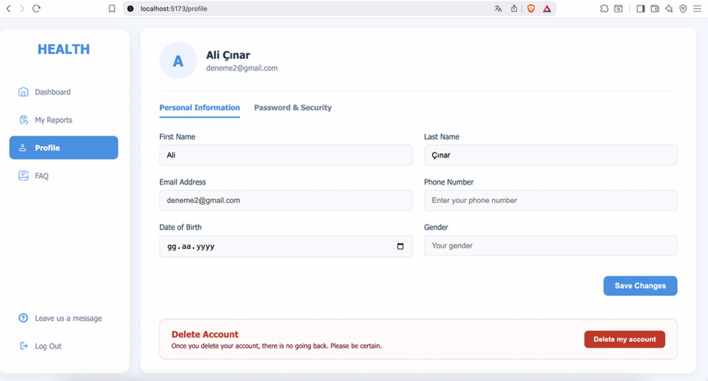

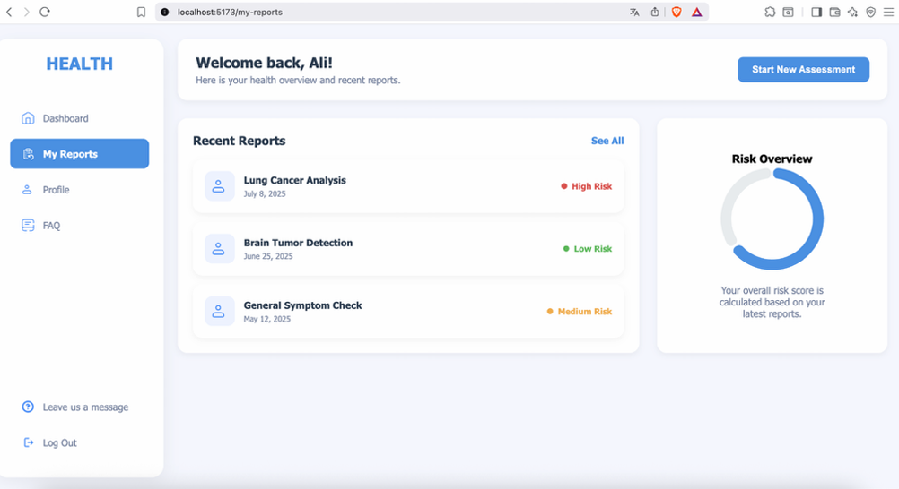

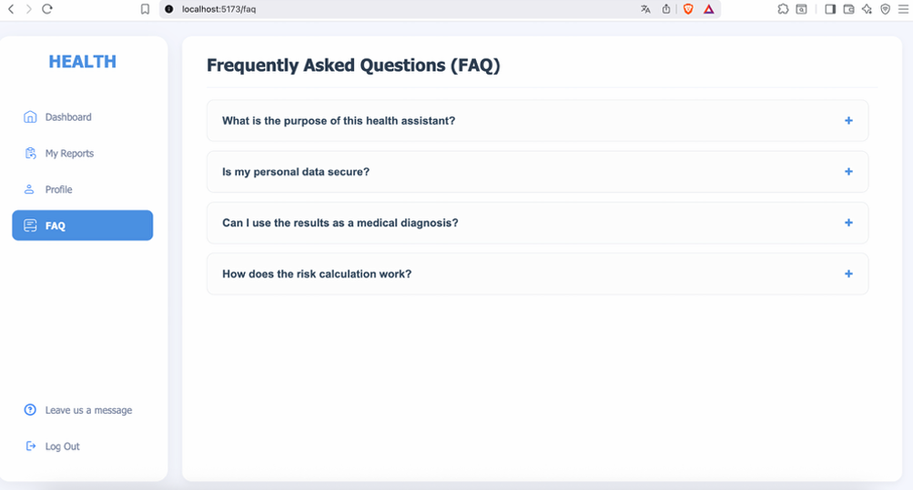

---

<strong style="font-size:1em">Backend</strong>

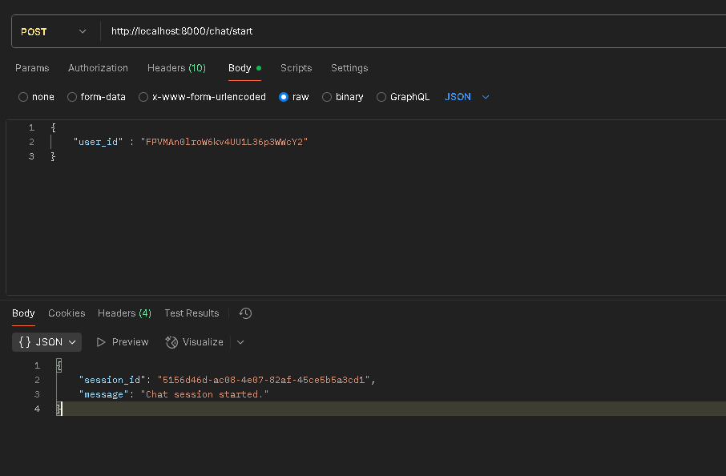

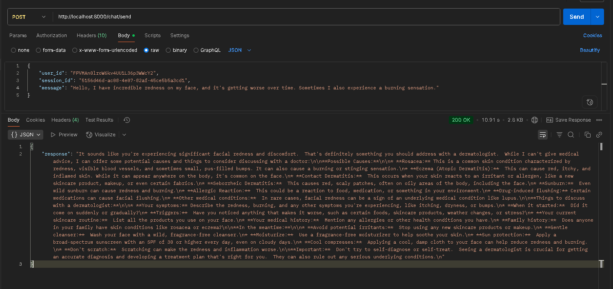

---

<strong style="font-size:1em">Machine Model</strong>

---
Colon Cancer : 

---
Skin Cancer :

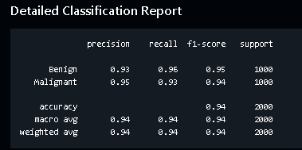

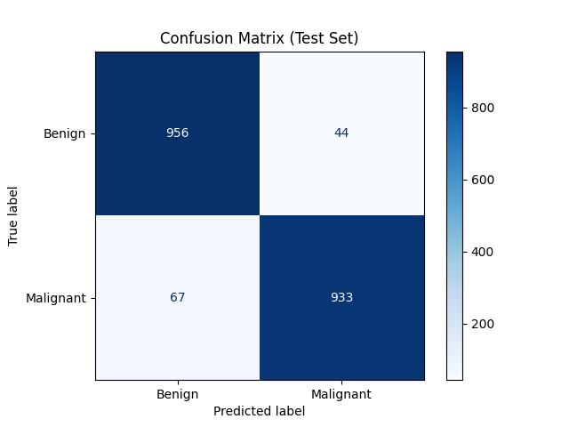

---

<strong style="font-size:2em">Sprint Review</strong>

The planned work for this sprint was largely completed, with notable progress and initiative shown across multiple areas:

- While only core pages were initially scoped, additional pages like FAQ and History were also designed and implemented, enhancing UI consistency and completeness.
- Backend architecture was refactored into a modular structure.
- LLM-related endpoints were created, allowing the system to begin communication with the language model.  
- Machine learning models for five different cancer types — Colon, Lung, Leukemia (Blood Cancer), Brain Tumor, and Skin Cancer — were successfully trained and tested. Supporting Python methods for prediction and data transformation were also developed to facilitate backend integration.
- The team continued to improve coordination and cross-functional collaboration, aligning efforts across frontend, backend, and ML tasks to increase efficiency.

---

<strong style="font-size:2em">Sprint Retrospective</strong>

### What Went Well
- The training and evaluation of ML models progressed exceptionally well. In just a short two-week sprint, datasets for **five different cancer types** (Colon, Lung, Leukemia, Brain Tumor, and Skin Cancer) were collected, preprocessed, and used to successfully train image classification models. Overfitting issues were resolved during training, and corresponding data transformation and prediction methods were implemented in Python, laying a solid foundation for integration.
- Although not originally planned for this sprint, FAQ and Report pages were both designed and implemented on the frontend, showing strong initiative and ownership from the responsible team member.
- Initial integration steps were taken with the LLM, including the implementation of basic communication and session-handling logic on the backend. While limited in scope, this progress marked an important step toward system-wide functionality.

---

### What Went Badly
- The LLM prompt for the Detailed Analysis module was expected to be finalized in this sprint but was delayed due to the availability constraints of the assigned team member.
- UI testing remains insufficient; despite some manual tests, automated test coverage is still lacking and needs to be prioritized.
- Integration efforts — especially between ML models and the backend — progressed slower than necessary. Not a single full end-to-end connection (ML → Backend → Frontend) was completed during this sprint.

---

### Areas for Improvement
- Integration efforts should be initiated earlier in the sprint cycle, particularly when multiple teams or components (e.g., ML, backend, frontend) are involved. Delaying these steps creates avoidable dependencies near sprint-end.
- Task planning must better reflect realistic availability of contributors, especially for components requiring specialized domain knowledge (e.g., LLM).
- More frequent cross-functional checkpoints should be scheduled to ensure blockers in one part of the stack are surfaced early and resolved quickly.
- Tasks were distributed without actively monitoring emerging bottlenecks during the sprint. There should be a mechanism to reassign available team members to support areas that are falling behind, especially for integration-critical tasks.

---

### Next Sprint Tasks
- Finalize and validate the LLM prompt for Detailed Analysis, enabling advanced text-based interpretations for the supported cancer types.
- Begin full ML–Backend integration, starting with one cancer model and expanding gradually. Create endpoints that allow the frontend to request predictions.
- Implement the Frontend–Backend connection for prediction features, especially for pages like Report that will display model results.

---

<strong style="font-size:2em">Communication and Project Management Tools</strong>

- **Code Management:** All code repositories are managed on GitHub, with version control in place. The development process is tracked through pull requests.

- **Project Management:** Task assignments and sprint tracking are carried out via the Asana platform.

- **Team Communication:** Instant communication within the team is facilitated through WhatsApp.

- **Daily Progress Tracking:**  Daily reporting is conducted through Google Forms. Each team member fills out a short form at the end of the day to report completed work and any encountered blockers.

- **Weekly Meetings:** During the meetings, team members share what they have done, any problems they are facing, what they plan to do next, and what actions they will take before the next meeting. These online meetings are held twice a week (Mondays at 22:00 and Fridays at 22:00) via Google Meet.

